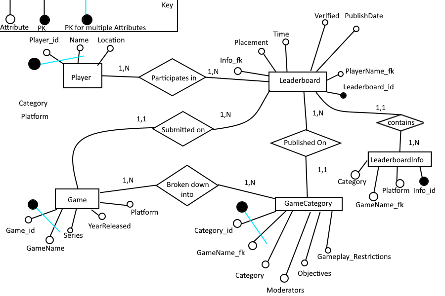

Updated SQL code and database. Entity Relationship and Relational Diagrams included. Completed in May 2021. 
# Updated Description
Gamers who play video games with the intent to complete them as fast as possible can film themselves playing the game and publish it onto a leaderboard database to compare with other gamers. Gamers can view each other’s statistics to compare as well as submit their performance to compete with other gamers on the database. \
The database will keep track of the players, the game categories, the games, and the actual leaderboard. The player table will keep track of general information about the player such as their name and location. The game category tables focus on aspects of each games’ specific category such as who moderates it and the names of the category and game as well as rules to play through. The game table lists out information about the games such as year released, connected series, name, and platform you can play the game on. The leaderboard table keeps track of posted speed runs connecting them to the specific player, the specific game, and specific game category. This is connected through the previously mentioned tables. Game name, category name, and player name are all primary keys that are referenced (foreign key) in the leaderboard table. 
# Relational Design
*PK is italicized*, FK is listed as "FK" 
Player(*player_id*, *name*, location) \
GameCategory(*category_id*, gameName_fk, category, moderators, objectives, gameplay_restrictions) \
Game(*game_id*, *gameName*, series, yearReleased, platform) \
LeaderboardInfo(*Info_id*, gameName_fk, category_fk, platform) \
Leaderboard(*leaderboard_id*, placement, playerName_fk, time, verified, publishDate, info_fk ) 
# Entity Relationship Design

